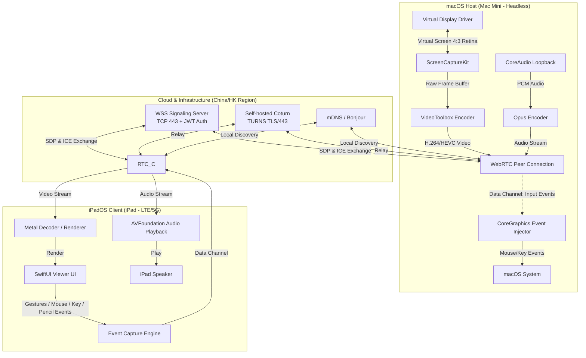
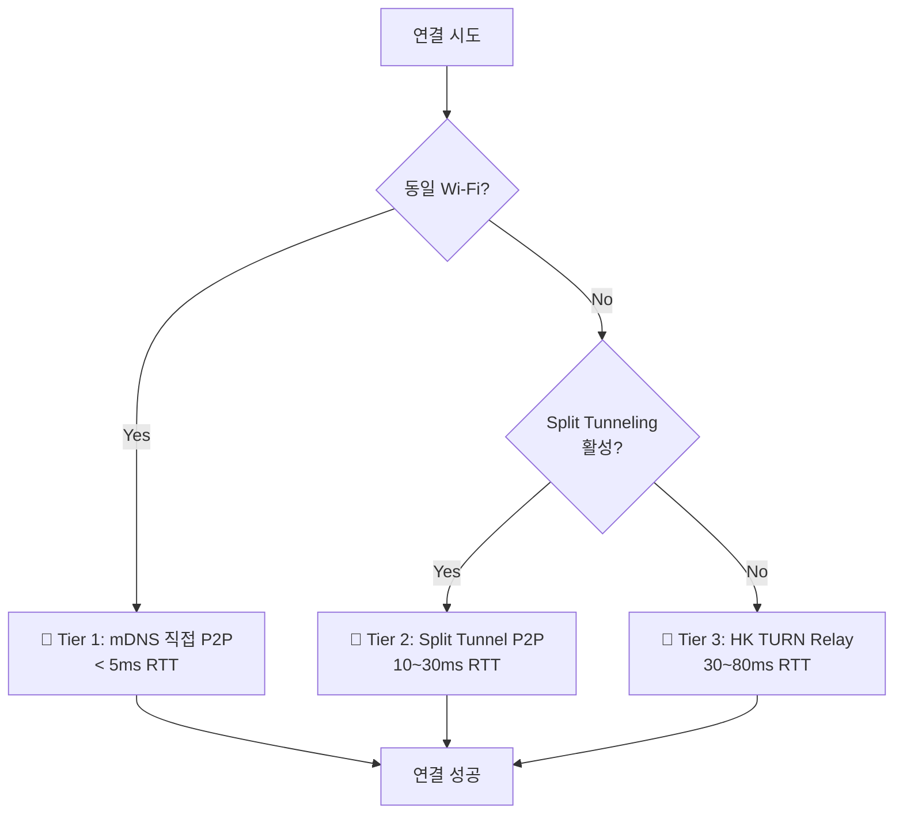

# 맥미니-아이패드 무선 원격 제어 프로그램 (Jump Desktop Clone) 마스터 계획서 & PRD

본 문서는 사용자의 요구사항을 반영하여 **가상 디스플레이 지원(Headless Mac Mini)**, **LTE/5G 외부 네트워크 접속**, 그리고 **중국(China) 네트워크 환경 대응**을 핵심 사양으로 확정하고, 초저지연 WebRTC 연동 규격 및 단계별 개발 로드맵을 통합한 **마스터 제품 요구사항 정의서(Master PRD)**이자 **기술 구현 계획서(Implementation Plan)**입니다.

---

## 🎯 1. Project Context & Instructions for AI (프로젝트 컨텍스트)

**To the AI Agent (AntiGravity):**
You are an expert macOS/iOS Swift engineer and WebRTC specialist. Your task is to build a high-performance, ultra-low latency remote desktop application consisting of three distinct parts: a macOS Host, an iPadOS Client, and a Node.js Signaling Server.
You must strictly follow the architecture, tech stack, and phase-by-phase implementation plan defined below. Do not mix Host and Client codebases. Always ensure macOS sandbox and permission configurations (Info.plist, Entitlements) are handled before logic implementation.

**운영 환경 현황:**
- **맥미니(Host)**: 중국 내 위치, **Astrill VPN 항시 구동** (인터넷 → VPN 터널 → 해외 Exit Node)
- **아이패드(Client)**: 중국 내 위치, VPN 없음 (순수 중국 ISP 네트워크)
- **핵심 목표**: 연결 지연(Latency) 최소화가 최우선 과제

**중국 환경 특수 지침:**
- Google 서비스(STUN 포함)는 GFW에 의해 차단됨. `stun.l.google.com` 절대 사용 금지.
- 맥미니의 VPN으로 인한 **Hairpinning 지연**을 방지하기 위해 Astrill **Split Tunneling(Application Filter)** 필수 적용.
- 3단계 연결 우선순위: ① 동일 Wi-Fi mDNS 직접 연결 → ② Split Tunneling P2P → ③ 홍콩 TURN 릴레이.
- npm은 `registry.npmmirror.com` 미러 사용, SPM은 Git proxy 또는 로컬 캐싱 활용.

---

## 🛠 2. Technology Stack Specification (기술 스택 사양)

| Component | Target OS / Env | Core Frameworks / Languages |
| --- | --- | --- |
| **Host App** | macOS 12+ (Apple Silicon optimized) | Swift, AppKit, ScreenCaptureKit, CoreGraphics (Input Injection), WebRTC (Swift bindings via `stasel/WebRTC`), CoreAudio |
| **Client App** | iPadOS 15+ | Swift, SwiftUI, AVFoundation / Metal (Rendering), WebRTC (Swift bindings via `stasel/WebRTC`), UIHoverGestureRecognizer |
| **Signaling Server** | Node.js (China Cloud / HK Region) | TypeScript, ws (WebSocket over WSS/443), JWT Authentication |
| **P2P Network** | WebRTC | Self-hosted Coturn (TURNS/TLS/443), SCTP (DataChannel for Input/Clipboard), SRTP, H.264/HEVC (VideoToolbox), Opus (Audio) |

### 2.1. WebRTC 프레임워크 확정

| 항목 | 결정 |
| --- | --- |
| **패키지** | `stasel/WebRTC` (Google WebRTC pre-built binary, GitHub 미러) |
| **SPM URL** | `https://github.com/nicephoton/nicephoton-webrtc-ios-prebuilt` or `https://github.com/nicephoton/nicephoton-webrtc-ios` |
| **중국 대응** | 바이너리를 사전 다운로드하여 프로젝트 로컬에 포함하거나, Git proxy를 통해 SPM resolve |

### 2.2. 성능 목표 수치 (Performance Targets)

| 지표 | Wi-Fi (로컬) | 5G/LTE (외부) | LTE 절약 모드 |
| --- | --- | --- | --- |
| **RTT (Round-Trip Time)** | < 20ms | < 50ms | < 100ms |
| **프레임 레이트** | 60fps | 30~60fps (ABR) | 24~30fps |
| **해상도** | iPad 네이티브 (2732×2048 @2x) | 1920×1440 (동적 축소) | 1366×1024 |
| **비트레이트 (Video)** | 15~25 Mbps | 5~15 Mbps (ABR) | 2~5 Mbps |
| **오디오 코덱** | Opus 128kbps | Opus 64kbps | Opus 32kbps |

---

## 🧱 3. System Architecture & Module Boundaries (시스템 아키텍처 및 모듈 경계)

### 3.1. 아키텍처 다이어그램 (Architecture Diagram)



### 3.2. Host Architecture (macOS Host 모듈 경계)
* **CaptureEngine:** Uses ScreenCaptureKit to grab screen frames. Must support YUV 4:4:4 color space settings to prevent text bleeding.
* **AudioEngine:** Captures system audio loopback using CoreAudio Loopback. Encodes to Opus and feeds to RTCAudioTrack.
* **WebrtcManager:** Manages PeerConnection, adds Video/Audio tracks, and listens to the DataChannel. Configures ICE servers with self-hosted Coturn only (no Google STUN).
* **InputInjector:** Parses JSON commands from the DataChannel and injects CGEvent (Mouse Move, Click, Scroll, KeyDown/Up) into the macOS system.
* **ClipboardManager:** Monitors NSPasteboard and syncs text/image payload over DataChannel.

### 3.3. Client Architecture (iPadOS Client 모듈 경계)
* **WebrtcManager:** Connects to Signaling Server, establishes PeerConnection, receives Video/Audio tracks. Includes Auto-Reconnect with exponential backoff.
* **RenderView:** Wraps RTCMTLVideoView or AVSampleBufferDisplayLayer in UIViewRepresentable for SwiftUI integration.
* **InputController:** Captures iPad gestures (Tap, Pan, Pinch), Magic Keyboard/Mouse events, and Apple Pencil input. Converts them to standardized JSON payloads.
* **ClipboardManager:** Syncs UIPasteboard with received DataChannel payloads.

### 3.4. WebRTC DataChannel Protocol (JSON Schema)
AI가 파싱과 주입을 정확히 할 수 있도록 DataChannel 통신 규격을 강제합니다.

#### A. Mouse Event Payload
```json
{
  "type": "mouse",
  "action": "move", // move, down, up, scroll
  "button": "left", // left, right, middle (if action is down/up)
  "x": 1024.5, // Absolute or relative coordinates
  "y": 768.0,
  "deltaX": 0, // For scroll or relative movement
  "deltaY": 10
}
```

#### B. Keyboard Event Payload
```json
{
  "type": "keyboard",
  "action": "down", // down, up
  "keyCode": 123, // macOS standard keycode
  "modifiers": ["command", "shift"]
}
```

#### C. Clipboard Sync Payload
```json
{
  "type": "clipboard",
  "dataType": "text", // text, image
  "content": "Base64_Encoded_String_Here"
}
```

#### D. Apple Pencil Event Payload
```json
{
  "type": "pencil",
  "action": "move", // down, move, up
  "x": 512.3,
  "y": 384.7,
  "pressure": 0.75, // 0.0 ~ 1.0 (force)
  "tiltX": 15.0, // degrees
  "tiltY": -5.0,
  "azimuth": 1.2 // radians
}
```

---

## 🌐 4. China Network & Infrastructure Strategy (중국 네트워크 대응 전략)

> **GFW(Great Firewall)에 의해 Google 서비스, 표준 WebRTC 인프라, GitHub 등이 차단 또는 불안정합니다. 또한 맥미니에서 Astrill VPN이 항시 구동 중이므로, VPN에 의한 Hairpinning 지연을 반드시 방지해야 합니다.**

### 4.1. ⚡ VPN Hairpinning 문제 및 핵심 대응 전략

**문제 분석: VPN이 지연 시간에 미치는 치명적 영향**

맥미니와 아이패드가 같은 도시에 있더라도, 맥미니의 Astrill VPN이 활성화되면:

```
❌ VPN 활성 (Split Tunneling 없음) — Hairpinning 발생:

  iPad (중국 ISP IP)  →  중국 ISP  →  국제 백본  →  VPN Exit (미국/일본)
                                                        ↓
  Mac Mini (중국 물리 위치)  ←  VPN 터널  ←  국제 백본  ←  VPN Exit

  예상 RTT: 200~400ms+ (사용 불가 수준)
```

이는 WebRTC P2P 연결 시 맥미니의 공인 IP가 **VPN Exit 국가의 IP**로 노출되기 때문입니다. 아이패드에서 보내는 모든 패킷이 해외를 왕복하게 됩니다.

**해결책: 3단계 연결 우선순위 (Latency-Optimized Connection Tiers)**



| 우선순위 | 연결 방식 | 예상 RTT | 조건 | VPN 상태 |
| --- | --- | --- | --- | --- |
| 🥇 **Tier 1** | mDNS/Bonjour 직접 P2P | **< 5ms** | 동일 Wi-Fi 네트워크 | VPN 무관 (LAN 내부) |
| 🥈 **Tier 2** | Split Tunneling + China P2P | **10~30ms** | Astrill Application Filter로 Host App VPN 제외 | Host App만 VPN 우회 |
| 🥉 **Tier 3** | 홍콩 TURN 릴레이 | **30~80ms** | 외부망 (LTE/5G 등) | VPN 활성 (Fallback) |
| ❌ **최악** | VPN Hairpinning (미국/일본) | **200~400ms+** | Split Tunneling 미설정 | 전체 터널링 |

### 4.2. 🔧 Astrill VPN Split Tunneling 설정 (필수)

**맥미니에서 Host App의 WebRTC 트래픽을 VPN에서 제외**해야 합니다.

#### 방법 A: Application Filter (앱 단위 제외) — 권장
1. Astrill VPN 앱 열기 → **Settings** → **Application Filter**
2. **"Exclude these apps"** 모드 선택
3. 제외 목록에 **JumpDesktop Host App (HostApp.app)** 추가
4. OK 저장

→ 결과: Host App의 모든 네트워크 트래픽은 중국 ISP를 통해 직접 전송됨. 나머지 앱(브라우저 등)은 기존처럼 VPN 사용.

#### 방법 B: Smart Mode 사용
1. Astrill → **Smart Mode** 활성화
2. 중국 내 로컬 트래픽은 자동으로 직접 연결, 국제 트래픽만 VPN 터널
3. 단, 자체 서버 IP가 중국 내에 있어야 Smart Mode가 올바르게 라우팅

#### 방법 C: Site Filter (IP 기반 제외)
1. Astrill → **Settings** → **Site Filter**
2. Coturn TURN 서버 IP 및 시그널링 서버 IP를 **제외 목록**에 추가
3. 해당 IP로의 트래픽만 VPN 우회

> **⚠️ 중요:** 개발/디버깅 시에는 프로토콜을 OpenWeb, OpenVPN, StealthVPN, 또는 WireGuard 중 하나로 설정해야 Application Filter가 동작합니다.

### 4.3. STUN/TURN 서버 전략

| 항목 | 사양 |
| --- | --- |
| **서버 소프트웨어** | Coturn (오픈소스) |
| **Primary 배치 위치** | 홍콩 리전 (ICP 비안 불필요, 중국 접근성 양호) |
| **Secondary 배치 (선택)** | 알리바바/텐센트 클라우드 중국 내 리전 (ICP 비안 필요하나 최저 지연) |
| **프로토콜** | **TURNS (TURN over TLS/DTLS)** — 필수 |
| **포트** | **TCP 443** (HTTPS로 위장하여 DPI 우회) |
| **Fallback 순서** | TURNS/443 → TURNS/80 → TCP Relay |
| **금지 사항** | ❌ `stun.l.google.com` 및 모든 Google STUN 서버 사용 금지 |
| **금지 사항** | ❌ UDP 3478 포트 단독 사용 금지 (DPI 차단됨) |

**ICE 서버 설정 예시 (Swift) — Split Tunneling 적용 후:**
```swift
let iceServers = [
    // Primary: 홍콩 TURN 서버 (중국에서 ~20-40ms)
    RTCIceServer(
        urlStrings: ["turns:turn.your-domain.hk:443?transport=tcp"],
        username: "user",
        credential: "password"
    ),
    // Secondary: 중국 내 TURN 서버 (배치한 경우, ~5-15ms)
    RTCIceServer(
        urlStrings: ["turns:turn.your-domain.cn:443?transport=tcp"],
        username: "user",
        credential: "password"
    )
]
// ❌ 절대 사용 금지:
// RTCIceServer(urlStrings: ["stun:stun.l.google.com:19302"])
```

### 4.4. 시그널링 서버 배치

| 항목 | 사양 |
| --- | --- |
| **Primary 배치** | 홍콩 리전 (AWS AP-East-1, Alibaba HK, Tencent HK) |
| **프로토콜** | WSS (WebSocket Secure) over TCP 443 |
| **인증** | JWT 토큰 기반 인증 (무인증 연결 금지) |
| **도메인** | 홍콩 리전이면 ICP 비안 불필요 |
| **컨테이너화** | Docker 기반 배포 권장 |

> **Tip:** 시그널링은 SDP/ICE 교환(수 KB)만 처리하므로 홍콩 배치 시 지연 영향 미미. 실제 미디어 스트림은 P2P 직접 연결.

### 4.5. 연결 모드별 네트워크 흐름 상세

#### Tier 1: 동일 Wi-Fi mDNS 직접 연결 (최적)
```
iPad ←──── LAN (192.168.x.x) ────→ Mac Mini
           직접 P2P, 외부 서버 불필요
           RTT: < 5ms
```
- mDNS/Bonjour로 피어 자동 발견
- 시그널링도 로컬 소켓으로 가능 (외부 서버 불필요)
- VPN 영향 없음 (LAN 트래픽은 VPN 터널에 포함되지 않음)

#### Tier 2: Split Tunneling + 외부망 P2P (양호)
```
iPad (중국 ISP) ←──── 중국 내부 네트워크 ────→ Mac Mini (중국 ISP, VPN 우회)
                     TURN 릴레이 또는 직접 P2P
                     RTT: 10~30ms
```
- Astrill Application Filter로 Host App을 VPN에서 제외
- 맥미니가 중국 ISP의 실제 공인 IP를 사용
- 양쪽 모두 중국 IP이므로 국내 라우팅으로 저지연 달성

#### Tier 3: 홍콩 TURN 릴레이 (Fallback)
```
iPad (중국 ISP) ──→ HK TURN Server ──→ Mac Mini (VPN 또는 직접)
                    릴레이 경유
                    RTT: 30~80ms
```
- Split Tunneling 불가 시 또는 NAT 관통 실패 시
- 홍콩은 중국 주요 도시에서 물리적으로 가까워 지연 최소

### 4.6. 개발 환경 설정 (중국 내 개발자용)

```bash
# ── npm 중국 미러 설정 ──
npm config set registry https://registry.npmmirror.com

# ── Git proxy 설정 (Astrill VPN 사용 시, 포트는 Astrill 설정 확인) ──
git config --global http.proxy http://127.0.0.1:7890
git config --global https.proxy http://127.0.0.1:7890

# ── Swift Package Manager 대응 ──
# 방법 1: Git proxy를 통한 SPM resolve (위 proxy 설정 후 Xcode에서 자동 적용)
# 방법 2: 의존성 사전 다운로드 후 로컬 패키지 참조
#   .package(path: "../LocalWebRTC")
# 방법 3: xcodebuild CLI 사용 (환경변수 상속 보장)
xcodebuild -resolvePackageDependencies
```

### 4.7. 규정 준수 참고 (개인 사용 시)

| 규정 | 적용 여부 | 비고 |
| --- | --- | --- |
| **ICP 비안(备案)** | 홍콩 리전 배치 시 불필요 | 중국 내 배치 시 필요 |
| **PIPL (개인정보보호법)** | 개인 사용 시 리스크 낮음 | 상용화 시 데이터 현지화 의무 |
| **사이버보안법** | 개인 사용 시 리스크 낮음 | 상용화 시 컴플라이언스 필수 |

---

## 🚀 5. Step-by-Step Implementation Plan (AI Task List)

**AI Agent Must Execute These Phases Sequentially. Do not proceed to the next phase until the current phase is fully functional and verified.**

### 📍 Phase 1: Signaling Server & Basic WebRTC Setup
1. **[Infra - VPN 설정]** 맥미니 Astrill VPN에서 **Application Filter** 설정: Host App을 "Exclude these apps" 목록에 추가하여 WebRTC 트래픽이 VPN을 우회하도록 구성.
2. **[Infra - TURN]** 홍콩 리전 클라우드에 Coturn TURN 서버 배포. TURNS(TLS) + TCP 443 설정 완료.
3. **[Server]** Create a Node.js WebSocket server using TypeScript and `ws`. Implement room creation, JWT-based authentication, and message broadcasting for SDP Offer/Answer and ICE Candidates. Deploy to HK cloud with WSS on port 443.
4. **[Host & Client]** Set up basic Swift project structures. Add WebRTC framework via SPM (`stasel/WebRTC`). 중국 환경에서는 바이너리 사전 다운로드 또는 Git proxy 사용.
5. **[Host & Client]** Implement `SignalingClient` class in both apps to connect to the Node.js server via WSS. Include JWT token in connection handshake.
6. **[Host & Client]** Configure ICE servers with self-hosted Coturn **only** (no Google STUN). Use TURNS/TLS/443.
7. **[Host & Client]** Implement 3-tier connection logic: ① mDNS local discovery → ② Direct P2P (Split Tunneling) → ③ HK TURN Relay.
8. *Validation:* Host and Client can successfully exchange SDP and ICE candidates and establish a `RTCPeerConnection` state of **connected**. Verify RTT from within China: Tier 1 < 5ms, Tier 2 < 30ms, Tier 3 < 80ms.

### 📍 Phase 2: Host Screen Capture & Audio/Video Streaming
1. **[Host]** Update Info.plist with `NSScreenCaptureUsageDescription`. Generate permission request script/instructions.
2. **[Host]** Implement `ScreenCaptureKit` stream. Configure it to output `CMSampleBuffer` with YUV 4:4:4 color space.
3. **[Host]** Wrap the captured buffer into an `RTCVideoFrame` and feed it to an `RTCVideoTrack`.
4. **[Host]** Implement CoreAudio Loopback capture. Feed audio samples to an `RTCAudioTrack`.
5. **[Host]** Add both VideoTrack and AudioTrack to the PeerConnection.
6. *Validation:* Host successfully grabs the screen and system audio without crashing and sends both video and audio packets.

### 📍 Phase 3: Client Video/Audio Rendering & Auto-Reconnect
1. **[Client]** Implement `RTCMTLVideoView` or `AVSampleBufferDisplayLayer` within a SwiftUI view (`UIViewRepresentable`) to display the incoming `RTCVideoTrack`.
2. **[Client]** Implement audio playback for the incoming `RTCAudioTrack` via AVFoundation.
3. **[Client]** Add connection state UI (Connecting, Connected, Disconnected, Failed).
4. **[Client]** Implement Auto-Reconnect logic with **exponential backoff** (1s → 2s → 4s → 8s → max 30s) if ICE connection state changes to disconnected or failed.
5. *Validation:* iPad displays the Mac Mini screen in real-time and plays system audio with minimal latency.

### 📍 Phase 4: Remote Input Control (The Reverse Channel)
1. **[Host & Client]** Open an `RTCDataChannel` named `"input_control"` alongside the media tracks.
2. **[Client]** Implement iPad touch gestures, Magic Keyboard capturing, and Apple Pencil input. Serialize these events into the defined JSON schema (mouse, keyboard, pencil) and send via DataChannel.
3. **[Host]** Update `Info.plist` and entitlements for Accessibility (Accessibility API usage). Generate permission request instructions.
4. **[Host]** Parse incoming JSON on the DataChannel. Use `CGEvent` to synthesize and inject mouse movements, clicks, keyboard strokes, and tablet pressure events into macOS.
5. *Validation:* Tapping/typing on the iPad physically controls the Mac Mini. Apple Pencil pressure is reflected.

### 📍 Phase 5: Advanced Features & Headless Support
1. **[Host]** Implement Virtual Display logic. If no physical monitor is detected, initialize a virtual display matching the iPad's aspect ratio (e.g., 4:3 Retina at 2x scale factor). Target `ScreenCaptureKit` to this virtual display using `CGVirtualDisplay` or DriverKit.
2. **[Host & Client]** Implement two-way Clipboard synchronization using `NSPasteboard` and `UIPasteboard` via the DataChannel.
3. **[Client]** Implement Pointer Lock API / relative mouse movement handling to capture relative mouse movements from the iPad Magic Keyboard trackpad (crucial for accurate desktop-class UX).
4. **[Host & Client]** Implement connection quality monitor: display real-time RTT, packet loss, connection tier (Tier 1/2/3) in UI overlay.

---

## 🔒 6. Critical Constraints & Security (필수 준수 사항)

* **macOS Permissions (권한 설정):** The AI must generate scripts or clear instructions on how to request Accessibility and Screen Recording permissions on macOS, as the Host app will silently fail without them.
* **Thread Safety (스레드 안전성):** WebRTC callbacks occur on background threads. The AI must use `DispatchQueue.main.async` when updating SwiftUI views or injecting `CGEvent`.
* **Retina Resolution (해상도 스케일링):** When setting up the Virtual Display or WebRTC Video source, ensure the scale factor (2x) is accounted for to prevent blurry text.
* **Network & Security (보안성):** DTLS/SRTP를 통한 미디어 스트림 암호화 필수 및 외부 통신(WSS) 보안 규격 유지.
* **Signaling Authentication (시그널링 인증):** 시그널링 서버 접속 시 JWT 토큰 기반 인증 필수. 무인증 WebSocket 연결 금지.
* **China Network (중국 네트워크):** Google STUN 서버 사용 금지. 모든 TURN 트래픽은 TURNS(TLS)/TCP 443으로만 전송. UDP 3478 단독 사용 금지.

### 6.1. 에러 핸들링 & Fallback 전략

| 시나리오 | 대응 전략 |
| --- | --- |
| **ScreenCaptureKit 권한 거부** | 사용자에게 시스템 환경설정 > 개인정보 > 화면 기록 안내 팝업 표시 |
| **Accessibility 권한 거부** | 입력 주입 비활성화, 사용자에게 권한 요청 다이얼로그 표시 |
| **ICE 연결 실패** | Exponential backoff 재시도 (1s→2s→4s→8s→max 30s, 최대 10회) |
| **TURN 서버 불가** | Fallback: TURNS/443 → TURNS/80 → TCP Relay. 모두 실패 시 "서버 연결 불가" UI 표시 |
| **네트워크 대역폭 급감** | WebRTC ABR(Adaptive Bitrate) 자동 조절. 해상도/FPS 동적 하향 |
| **시그널링 서버 연결 끊김** | 5초 간격 자동 재연결, 30초 초과 시 "오프라인" 상태 UI 전환 |
| **DataChannel 끊김** | PeerConnection 유지 상태에서 DataChannel 재생성 시도 |

---

## 📂 7. Proposed Directory Structure (소스코드 디렉터리 구조)

```
jumpdesktop/
├── host/                    # macOS Host Application (Swift/C++)
│   ├── HostApp.xcodeproj
│   └── Sources/
│       ├── Capture/         # ScreenCaptureKit & CoreAudio 관련 모듈
│       ├── Input/           # CoreGraphics CGEvent 입력 주입 모듈
│       ├── Network/         # WebRTC Host & mDNS & Cloud Connection
│       └── Driver/          # CGVirtualDisplay 기반 가상 디스플레이 컨트롤러
├── client/                  # iPadOS Client Application (SwiftUI)
│   ├── ClientApp.xcodeproj
│   └── Sources/
│       ├── UI/              # SwiftUI 뷰 (연결 대시보드, 뷰어 화면)
│       ├── Render/          # Metal/AVSampleBuffer 디코더 및 렌더러
│       ├── Input/           # 터치, 제스처, 키보드, 마우스, 펜슬 수집 엔진
│       └── Network/         # WebRTC Client & Cloud Connection
├── server/                  # WebSocket Signaling Server (TypeScript)
│   ├── Dockerfile           # Docker 컨테이너 배포용
│   ├── package.json
│   └── src/
│       ├── index.ts         # WebSocket Signaling Core
│       ├── auth/            # JWT 인증 모듈
│       └── stun-turn/       # Coturn 설정 스크립트 및 환경 구성안
└── infra/                   # 인프라 배포 스크립트
    ├── coturn/              # Coturn Docker 설정 및 TLS 인증서 가이드
    └── deploy/              # 클라우드 배포 스크립트 (알리바바/텐센트)
```

---

## 🧪 8. Verification Plan (검증 계획)

### 8.1. VPN & 지연 시간 검증 (최최우선)
1. **Astrill Split Tunneling 검증**:
   * Astrill Application Filter에서 Host App을 "Exclude" 목록에 추가한 상태에서, Host App의 외부 IP가 **중국 ISP IP**인지 확인 (`curl ifconfig.me` 또는 유사 도구로 비교).
   * VPN이 여전히 다른 앱(브라우저 등)에서는 정상 작동하는지 확인.
2. **Tier별 RTT 측정**:
   * **Tier 1 (동일 Wi-Fi)**: mDNS로 발견 후 P2P 연결 → RTT **< 5ms** 확인.
   * **Tier 2 (Split Tunneling, 외부망)**: iPad 4G/5G + Mac Mini Split Tunnel → RTT **< 30ms** 확인.
   * **Tier 3 (HK TURN Relay)**: Split Tunneling 비활성 상태에서 HK TURN 경유 → RTT **< 80ms** 확인.
   * **Hairpinning 대조군**: Split Tunneling 없이 VPN 전체 터널링 시 RTT 측정 (200ms+ 예상, 이 값이 높을수록 Split Tunneling의 효과 입증).
3. **Tier 자동 전환 테스트**:
   * Wi-Fi 연결 → Tier 1 활성 확인 → Wi-Fi 끊기 → Tier 2/3으로 자동 Fallback 확인.

### 8.2. 중국 네트워크 환경 검증
1. **GFW 통과 테스트**:
   * 중국 내 네트워크(VPN 없음, 아이패드 기준)에서 시그널링 서버 WSS 연결 성공 확인.
   * Coturn TURNS/443 서버로 ICE relay candidate 획득 확인.
   * [Trickle ICE](https://webrtc.github.io/samples/src/content/peerconnection/trickle-ice/) 도구로 relay candidate 검증.
2. **TURN Fallback 테스트**:
   * TURNS/443 차단 시뮬레이션 후 TURNS/80 → TCP Relay Fallback 확인.

### 8.3. 외부망 및 헤드리스 연동 검증 시나리오
1. **LTE/5G 외부 원격 테스트**:
   * 맥미니는 사무실/가정의 유선 인터넷에 연결 (Astrill Split Tunneling 활성).
   * 아이패드는 5G/LTE 무선 네트워크에 연결하여 원격 연결 수립 및 반응 속도(RTT < 30ms 목표) 측정.
2. **Headless 연결 테스트**:
   * 맥미니의 HDMI 케이블을 모두 분리한 상태에서 재부팅.
   * 호스트 백그라운드 서비스 가동 및 아이패드 접속 시, 가상 디스플레이 비율(4:3)로 깨끗하게 로드되는지 확인.
3. **트랙패드 & 단축키 테스트**:
   * Magic Keyboard 트랙패드에서의 세밀한 텍스트 블록 지정 및 복사/붙여넣기(`Cmd + C`, `Cmd + V`)가 정상 작동하는지 확인.

### 8.4. 오디오 & 입력 검증
1. **오디오 동기화 테스트**: 영상과 음성 간 립싱크 오차 < 50ms 확인.
2. **Apple Pencil 테스트**: 필압/기울기 값이 호스트의 드로잉 앱(예: Preview)에서 정상 반영되는지 확인.
3. **Auto-Reconnect 테스트**: 네트워크 끊김 후 30초 이내 자동 재연결 성공 확인.
